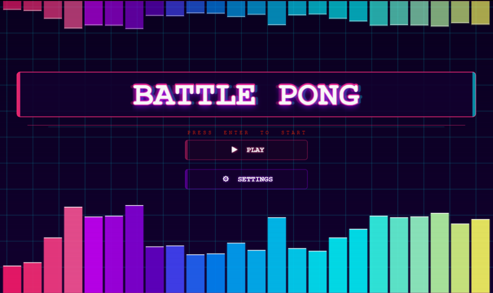

# Battle Pong

This is a personal Phaser 3 project template that uses Vite for bundling. It supports hot-reloading for quick development workflow and includes scripts to generate production-ready builds.

**[This Template is also available as a TypeScript version.](https://github.com/phaserjs/template-vite-ts)**

### Versions 

- [Phaser 3.90.0](https://github.com/phaserjs/phaser)
- [Vite 6.3.1](https://github.com/vitejs/vite)

## Requirements

[Node.js](https://nodejs.org) is required to install dependencies and run scripts via `npm`.

## Available Commands

| Command | Description |
|---------|-------------|
| `npm install` | Install project dependencies |
| `npm run dev` | Launch a development web server |
| `npm run build` | Create a production build in the `dist` folder |
| `npm run dev-nolog` | Launch a development web server without sending anonymous data (see "About log.js" below) |
| `npm run build-nolog` | Create a production build in the `dist` folder without sending anonymous data (see "About log.js" below) |

## Running the Code

After cloning the repo, run `npm install` from your project directory. Then, you can start the local development server by running `npm run dev`.

The local development server runs on `http://localhost:8080` by default. Please see the Vite documentation if you wish to change this, or add SSL support.

Once the server is running you can edit any of the files in the `src` folder. Vite will automatically recompile your code and then reload the browser.

## Template Project Structure

We have provided a default project structure to get you started. This is as follows:

| Path                         | Description                                                |
|------------------------------|------------------------------------------------------------|
| `index.html`                 | A basic HTML page to contain the game.                     |
| `public/assets`              | Game sprites, audio, etc. Served directly at runtime.      |
| `public/style.css`           | Global layout styles.                                      |
| `src/main.js`                | Application bootstrap.                                     |
| `src/game`                   | Folder containing the game code.                           |
| `src/game/main.js`           | Game entry point: configures and starts the game.          |
| `src/game/scenes`            | Folder with all Phaser game scenes.                        | 
