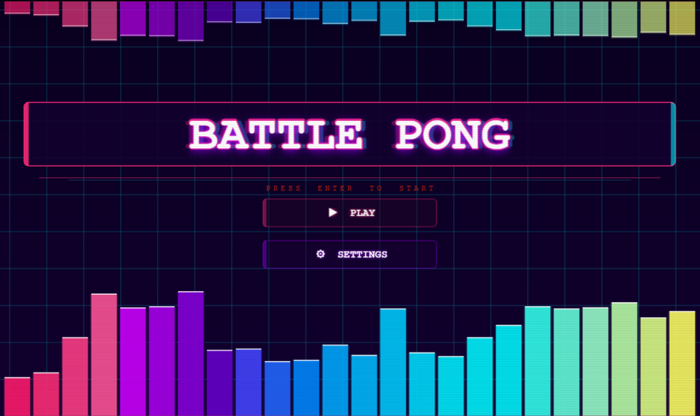

# Battle Pong

A neon, synthwave-flavored twist on Pong built with [Phaser 3](https://github.com/phaserjs/phaser) and [Vite](https://github.com/vitejs/vite). Two players face off with rotating paddles, a dash move, a screen-shaking Quake power-up, and independently controlled goalies — all set against an arena that pulses in time with the battle music.

AI (Claude) was used complementary to development, mainly for debugging and design suggestions.

## Gameplay

Battle Pong is local 2-player versus: first to **3 goals** wins. Beyond classic paddle-and-ball action, each player has:

- **Rotating paddle** — spin your paddle to change the angle the ball bounces off, instead of relying on paddle position alone.
- **Dash** — a short, high-speed burst in your last movement direction. Always available on a cooldown (shown as a bar at the top of the screen); hitting the ball while dashing adds extra speed to the return.
- **Quake** — a screen-shaking shockwave power-up that spawns randomly near the center of the arena. Pick one up (max 1 stored at a time) and unleash it to knock your opponent's paddle away from its position.
- **Goalie** — a separate unit that slides up and down the mouth of your own goal, independent of your paddle, giving you a second line of defense.

The ball speeds up with every hit (and gets an extra boost from dash hits), gradually decaying back toward its base speed between exchanges — so rallies escalate the longer they go.

## Controls

| Action | Player 1 | Player 2 |
|--------|----------|----------|
| Move | `W` `A` `S` `D` | Arrow Keys |
| Rotate Paddle | `Q` (CCW) / `E` (CW) | `,` (CCW) / `.` (CW) |
| Dash | `Shift` | `/` |
| Quake (when stored) | `F` | `L` |
| Goalie Up / Down | `T` / `G` | `I` / `K` |
| Pause / Resume | `Esc` | `Esc` |

The same key reference is available in-game from **Settings** on the main menu.

## Modes

From the mode select screen you can currently play:

- **2 Players** — local versus on one keyboard.
- **1 Player** (vs Computer) and **Online** are shown as upcoming modes and are not yet available.

## Requirements

[Node.js](https://nodejs.org) is required to install dependencies and run scripts via `npm`.

## Available Commands

| Command | Description |
|---------|-------------|
| `npm install` | Install project dependencies |
| `npm run dev` | Launch a development web server |
| `npm run build` | Create a production build in the `dist` folder |
| `npm run dev-nolog` | Launch a development web server without sending anonymous data (see "About log.js" below) |
| `npm run build-nolog` | Create a production build in the `dist` folder without sending anonymous data (see "About log.js" below) |

## Running the Code

After cloning the repo, run `npm install` from your project directory. Then, you can start the local development server by running `npm run dev`.

The local development server runs on `http://localhost:8080` by default. Please see the Vite documentation if you wish to change this, or add SSL support.

Once the server is running you can edit any of the files in the `src` folder. Vite will automatically recompile your code and then reload the browser.

## Project Structure

| Path                              | Description                                                        |
|------------------------------------|---------------------------------------------------------------------|
| `index.html`                       | Base HTML page that hosts the game canvas.                          |
| `public/assets`                    | Game audio and other assets served directly at runtime.             |
| `public/style.css`                 | Global layout styles.                                                |
| `src/main.js`                      | Application bootstrap.                                                |
| `src/game/main.js`                 | Phaser game config: registers scenes and starts the game.             |
| `src/game/scenes/MainMenu.js`      | Title screen.                                                          |
| `src/game/scenes/ModeSelect.js`    | Mode selection screen (2 Player, 1 Player, Online).                    |
| `src/game/scenes/Game.js`          | Core match scene: arena, scoring, HUD, pause menu, win screen.        |
| `src/game/scenes/Settings.js`      | In-game control reference / key bindings display.                     |
| `src/game/objects/Paddle.js`       | Player paddle: movement, rotation, dash, and Quake ability.           |
| `src/game/objects/Ball.js`         | Ball physics: speed scaling, dash boost, and decay.                   |
| `src/game/objects/Goalie.js`       | Player-controlled goalie unit that rides the goal mouth.               |
| `src/game/objects/PowerUp.js`      | Quake power-up pickup: spawning, lifetime, and collection.             |
| `src/game/objects/PowerUpManager.js` | Spawns and tracks active power-ups in a match.                        |

## About log.js

`log.js` sends a small anonymous ping (event name, Phaser version, project name) to the Phaser Studio team when running `npm run dev` or `npm run build`, to help them understand template usage. Use the `-nolog` script variants to skip this.

## Tech Stack

- [Phaser 3.90.0](https://github.com/phaserjs/phaser)
- [Vite 6.3.1](https://github.com/vitejs/vite)

## License

See [LICENSE](LICENSE).
